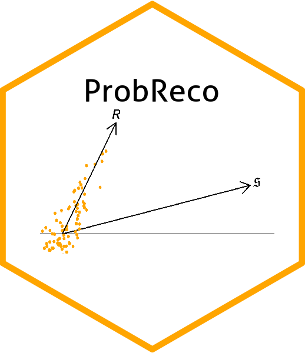

# ProbReco <a href='https://github.com/anastasiospanagiotelis/ProbReco'></a>


<!-- badges: start -->
  [](https://github.com/anastasiospanagiotelis/ProbReco/actions)
  <!-- badges: end -->


## Overview

A package for probabilistic forecast reconciliation based on score optimisation via stochastic gradient methods.  The main functions are

  - `scoreopt()` for score optimisation based on a rolling window of out of sample forecasts.
  - `scoreoptin()` for score optimisation based on using residuals (easier interface).

More information can be found in the package vignettes.

## Installation

``` r
# To download `ProbReco` from CRAN:
install.packages("ProbReco")

```

### Development version

To get a bug fix or to use a feature from the development version, you
can install the development version of `ProbReco` from GitHub.

``` r
# install.packages("devtools")
devtools::install_github("anastasiospanagiotelis/ProbReco")
```

## Getting help

If you encounter a clear bug, please file an issue with a minimal
reproducible example on
[GitHub](https://github.com/anastasiospanagiotelis/ProbReco/issues).
